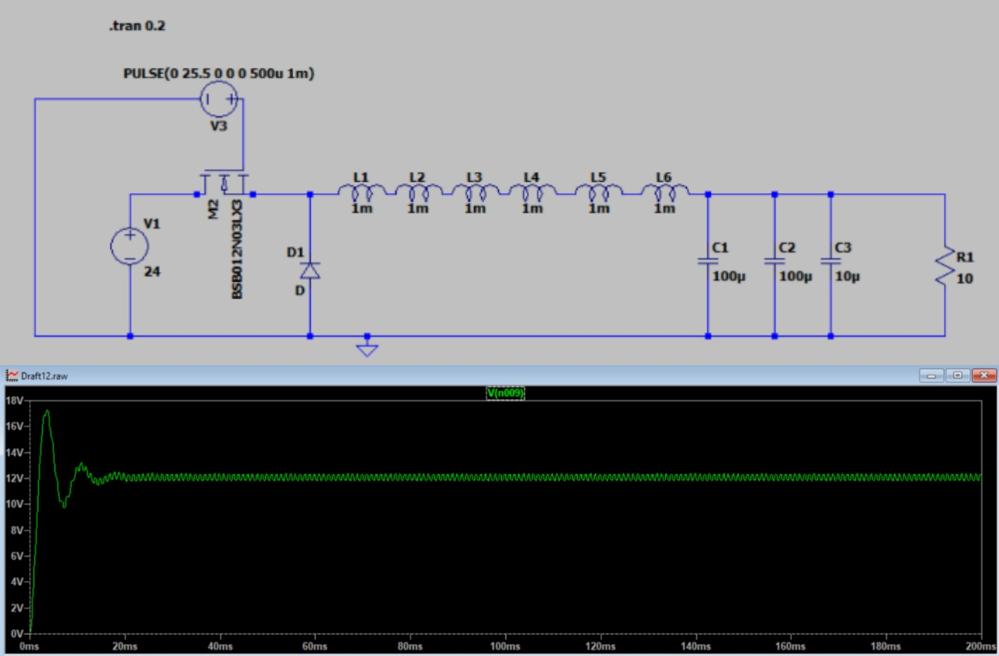
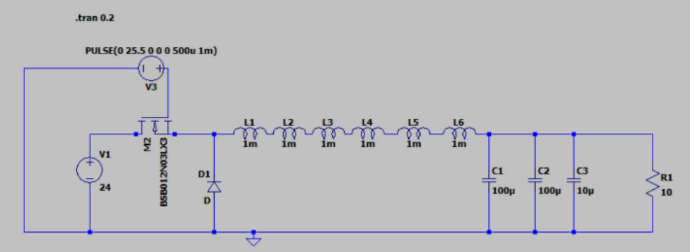
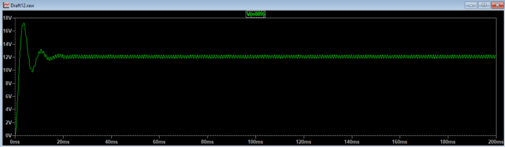

# Buck Converter Design & Simulation ⚡🔋

A complete design and simulation of a **DC-DC Buck (Step-Down) Converter**, including theoretical derivations, component calculations, and LTSpice circuit simulation.

<div align="center">
  
</div>

<br>
<div align="center">
  <a href="https://github.com/TendoPain18/buck-converter-design/raw/main/LTspice/buck-converter.asc">
    
  </a>
</div>

## 📋 Description

This project covers the complete design of a Buck converter — a DC-DC power converter that steps down an input voltage to a lower output voltage using a switch, inductor, diode, and capacitor. The design includes full theoretical analysis, component selection with real pricing, and LTSpice simulation verification.

## ✨ Features

- **Full Theoretical Derivation**: Inductor and capacitor equations from first principles
- **Complete Component Calculation**: Duty cycle, inductance, and capacitance values
- **LTSpice Simulation**: Circuit verification with transient analysis
- **Component Sourcing**: Real component pricing from Egyptian electronics stores

## 🔬 Theoretical Background

**When switch is closed:**
```
(ΔiL)closed = ((Vs - Vo) / L) × DT
```

**When switch is opened:**
```
(ΔiL)open = -(Vo / L) × (1 - D) × T
```

**Output voltage:**
```
Vo = Vs × D
```

**Inductor current ripple:**
```
ΔiL = Vo(1 - D) / (L × f)
```

**Required inductance:**
```
L = Vo(1 - D) / (ΔiL × f)
```

**Output voltage ripple:**
```
ΔVo / Vo = (1 - D) / (8LCf²)
```

**Required capacitance:**
```
C = (1 - D) / (8 × L × (ΔVo/Vo) × f²)
```

## 📊 Design Specifications & Results

**Specifications:**

| Parameter | Value |
|-----------|-------|
| Input Voltage (Vs) | 24 V |
| Output Voltage (Vo) | 12 V |
| Rated Power | 100 W |
| Inductor Current Ripple (ΔiL) | 1 A |
| Output Voltage Ripple (ΔVo/Vo) | 5% |
| Switching Frequency (f) | 1 kHz |

**Design Results:**

| Parameter | Value |
|-----------|-------|
| Duty Cycle (D) | 0.5 |
| T_on | 500 μs |
| Inductance (L) | 6 mH |
| Capacitance (C) | 208 μF |

## 🖥️ Simulation



*Buck converter circuit in LTSpice*



*Transient simulation output showing regulated 12V DC*

## 🛒 Component Sourcing (Egypt)

| Component | ram electronic | future electronics |
|-----------|---------------|-------------------|
| Inductor 1mH | 0.75 EGP | — |
| Capacitor 100uF | 2.25 EGP | — |
| MOSFET (IRF1010) | 35 EGP | 18 EGP |
| Diode (1N4007) | 0.5 EGP | 1 EGP |

## 🛠️ Built With

- **LTSpice XVII** — Circuit simulation

## 🚀 Getting Started

1. **Clone the repository**
```bash
git clone https://github.com/TendoPain18/buck-converter-design.git
```

2. **Open the LTSpice simulation**
   - Open `LTspice/buck-converter.asc` in LTSpice XVII
   - Run the transient simulation to view the output voltage waveform

## 📄 License

This project is licensed under the MIT License.

<br>
<div align="center">
  <a href="https://github.com/TendoPain18/buck-converter-design/raw/main/LTspice/buck-converter.asc">
    
  </a>
</div>

## <!-- CONTACT -->
<div id="toc" align="center">
  <ul style="list-style: none">
    <summary>
      <h2 align="center">
        🚀
        CONTACT ME
        🚀
      </h2>
    </summary>
  </ul>
</div>
<table align="center" style="width: 100%; max-width: 600px;">
<tr>
  <td style="width: 20%; text-align: center;">
    <a href="https://www.linkedin.com/in/amr-ashraf-86457134a/" target="_blank">
      
    </a>
  </td>
  <td style="width: 20%; text-align: center;">
    <a href="https://github.com/TendoPain18" target="_blank">
      
    </a>
  </td>
  <td style="width: 20%; text-align: center;">
    <a href="mailto:amrgadalla01@gmail.com">
      
    </a>
  </td>
  <td style="width: 20%; text-align: center;">
    <a href="https://www.facebook.com/amr.ashraf.7311/" target="_blank">
      
    </a>
  </td>
  <td style="width: 20%; text-align: center;">
    <a href="https://wa.me/201019702121" target="_blank">
      
    </a>
  </td>
</tr>
</table>
<!-- END CONTACT -->
